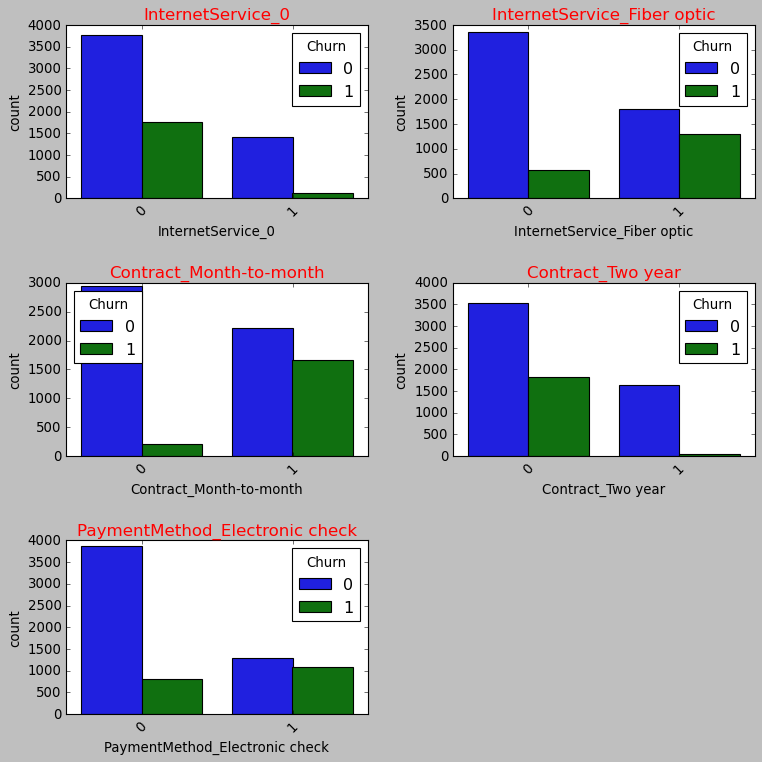

# Phase 3 Project - Customer Churn Telco

- Name: Andrew Levinton
- Student Pace: Self Pace
- Instructor name: Ahbhineet Kukarni

## Tech stack
- Python
- Pandas
- Matplotlib
- Seaborn
- Scikit-learn
- Math

## I. Business Understanding

# Business Problem:
- What does churn stand for?
Churn in a business setting refers to losing an acquired, potentially profitable customer. The definition of churn can vary by industry ( in Healthcare, dead people are considered churn while in finance, people with inactive cards are called churned).

- Why do businesses want to prevent churn?
Acquiring a new customer is always more expensive than retaining an existing one. Hence, not letting them churn is the key to a sustained revenue stream.

- What metrics do we optimize on while predicting churn?
F1-score and Recall are good ones, but you can also look at PR curves

The goals of this study will be:

- Analyze data from customer churn at Telcom - **metrics**
- Determine the best metrics to predict when a customer will/won't churn - **feature importance**
- Maximize Revenue per customer -  **preventing churn**
- Make Reccomendations to Telcom to prevent churn -  **Analyze the feature importance**

### Business Questions to consider:
1. What percentage of customers leave after one month? 6 months? 1 year? 72 months(6 years, which is the max)?
2. Which services have the highest impact on customer churn?
3. Can we calculate lifetime value of a customer?
4. How do we prevent senior citizens from churning?
5. What types of customers buy into long term contracts? How does that impact churn?
6. What services do customers with longer tenure have?

#### **Note** This is the final notebook of the study. If you want to see a more detail analysis of the data and where the modeling and visualization come from, please visit the [link to the github repository](https://github.com/andrewkoji/Phase_3_Project_churn.git) and look at the EDA notebook. You should be able to run both the final notebook and the EDA and get the same results.

Click to go to the dataset for more details on the column features, click [here](https://www.kaggle.com/datasets/blastchar/telco-customer-churn)

## II. Data Understanding
Next is the Data Understanding phase. Adding to the foundation of Business Understanding, it drives the focus to identify, collect, and analyze the data sets that can help you accomplish the project goals. This phase also has four tasks:

1. Collect initial data: Acquire the necessary data and (if necessary) load it into your analysis tool.
2. Describe data: Examine the data and document its surface properties like data format, number of records, or field identities.
3. Explore data: Dig deeper into the data. Query it, visualize it, and identify relationships among the data.
4. Verify data quality: How clean/dirty is the data? Document any quality issues.

## Telcom Customer Churn
- Each row represents a customer, each column contains customer’s attributes described on the column Metadata.

- The raw data contains 7043 rows (customers) and 21 columns (features).

**The “Churn” column is our target.**

`Churn` - a measure of the number of customers or employees who leave a company during a given period.

## Data Visualization

In this section, we will get a visual of the data against the target. The goal will be to observe how each feature is distributed within the data set. 

#### Initial observarions:
- 7032 rows, 21 columns
- This means we have: 7032 customers, 20 feature variables, 1 target (churn)
- The max tenure (number of months that a customer has stayed with the company) is 72 months, with an average of 32 months. 
- It would be interesting to see the types of contracts that people are on and see how it correlates with tenure. 

## Churn value counts

## Majority-Minority classes
In this dataset its clear that the majority class is the the customers not churning ("No") over the majority class ("Yes"). This will be addressed during model preparation.

## SMOTE(Synthetic Minority Over-sampling Technique) 

- SMOTE is a technique used in machine learning for handling imbalanced datasets, particularly in the context of classification problems. Imbalanced datasets refer to datasets where the number of instances belonging to one class (minority class) is significantly lower than the number of instances belonging to another class (majority class).

- By creating synthetic examples, SMOTE effectively increases the representation of the minority class, making it more balanced with the majority class. This helps in mitigating the bias of machine learning models towards the majority class and improves their ability to correctly classify instances from the minority class.

## III. Data Preparation

This phase, which is often referred to as “data munging”, prepares the final data set(s) for modeling. It has five tasks:

- Select data: Determine which data sets will be used and document reasons for inclusion/exclusion.
- Clean data: Often this is the lengthiest task. Without it, you’ll likely fall victim to garbage-in, garbage-out. A common practice during this task is to correct, impute, or remove erroneous values.
- Construct data: Derive new attributes that will be helpful. For example, derive someone’s body mass index from height and weight fields.
- Integrate data: Create new data sets by combining data from multiple sources.
- Format data: Re-format data as necessary. For example, you might convert string values that store numbers to numeric values so that you can perform mathematical operations.

## Dataframe Overview

## Observations

- Several features (as well as the target) have "Yes" and "No" listed as their unique values. 
- Yes/No values will be simplified for the columns that have "No internet service" and "No" as values. An example is if the customer does not have internet service, then they will not have any internet services.
- All features are categorical except for MonthlyCharges, TotalCharges, and the Tenure. 
    - because of the datatypes in the dataset, the following types of classifiers will be deployed on the dataset:
#### 1. Baseline Model - Decision Tree Classifier

- Decision trees have several advantages, including interpretability, as the resulting model can be easily visualized and understood. They can handle both numerical and categorical features and are robust to outliers. However, decision trees are prone to overfitting, particularly when the tree becomes deep and complex. To overcome this, ensemble methods like random forests are often used, which combine multiple decision trees to improve predictive performance.

#### 2. Bagging Classifier 

- A bagging classifier, short for bootstrap aggregating classifier, is an ensemble machine learning algorithm that combines multiple individual classifiers to make predictions. It is primarily used for classification tasks and aims to improve prediction accuracy and reduce overfitting. 

#### 3. Random Forest Classifier

- A random forest classifier is a specific type of bagging classifier where the base classifiers are decision trees. However, random forests introduce two key differences:

- Random Feature Subset Selection:
    In addition to creating bootstrap samples, random forests also employ a technique called random feature subset selection. At each node of a decision tree, instead of considering all features to determine the best split, random forests consider only a subset of features. This random subset selection reduces the correlation among the decision trees and promotes diversity in the ensemble.

- Ensemble Decision-Making:
    While bagging classifiers use majority voting or averaging to combine the predictions of individual base classifiers, random forests typically use a different approach. In a random forest, each decision tree in the ensemble independently makes a prediction, and the final prediction is determined by majority voting among the decision trees. This ensemble decision-making process ensures a robust and accurate prediction.

#### 4. Grid Search CV and pipelines

- Pipelines:
    In machine learning, a pipeline is a sequence of data preprocessing steps and a model training step combined into a single workflow. It allows for a streamlined and organized process of applying transformations to the data and training a model. A typical pipeline consists of several stages, such as data preprocessing (e.g., scaling, feature selection), feature engineering, and model training. Pipelines ensure that these steps are executed in a consistent and reproducible manner, simplifying the development and deployment of machine learning models.
Pipelines offer several benefits, including:

    - Automation: Pipelines automate the process of applying transformations to the data, reducing manual effort and the risk of errors.
    - Reproducibility: With pipelines, all preprocessing steps and model training are encapsulated in a single object, making it easier to reproduce the workflow.
    - Scalability: Pipelines can be easily extended with additional preprocessing steps or models, allowing for scalability and flexibility in machine learning workflows.
- Grid Search Cross-Validation:
    Hyperparameter tuning is a critical step in optimizing machine learning models. Grid search cross-validation is a technique used to systematically search for the best combination of hyperparameters for a given model. It involves defining a grid of hyperparameter values to explore and then evaluating the model's performance using each combination of hyperparameters through cross-validation.

## IV. Modeling
What is widely regarded as data science’s most exciting work is also often the shortest phase of the project.

Here you’ll likely build and assess various models based on several different modeling techniques. This phase has four tasks:

Select modeling techniques: Determine which algorithms to try (e.g. regression, neural net).
Generate test design: Pending your modeling approach, you might need to split the data into training, test, and validation sets.
Build model: As glamorous as this might sound, this might just be executing a few lines of code like “reg = LinearRegression().fit(X, y)”.
Assess model: Generally, multiple models are competing against each other, and the data scientist needs to interpret the model results based on domain knowledge, the pre-defined success criteria, and the test design.

## Baseline Model: Decision Tree Classifier

### Confusion matrix interpretation: Defining True positive, True Negative, False Positive, False Negative

- True Positive (TP): Model predicts churned (1) and the actual label is churned (1).
- True Negative (TN): Model predicts non-churned (0) and the actual label is non-churned (0).
- False Positive (FP): Model predicts churned (1), but the actual label is non-churned (0).
- False Negative (FN): Model predicts non-churned (0), but the actual label is churned (1).

#### Confusion matrix evaluation for False Negatives - Recall

- **Recall**, also known as sensitivity or true positive rate, measures the proportion of actual positive cases correctly identified by the model. It focuses on minimizing false negatives, which means it aims to avoid classifying positive cases as negative. 

- By emphasizing recall in the context of customer churn analysis, the decision tree model aims to correctly identify as many churned customers as possible, minimizing the chances of missing important cases. This enables the business to take appropriate actions, such as offering incentives or personalized offers, to retain those customers and reduce churn rates.

Observations:
- Contract Month-to-Month appears to have the highest effect on churn based on this tree
- Tenure(number of months in contract) appears to be the next most important feature for churn. 

#### Interpreting the recall:
- The recall for class 0 (customers not churning) of 0.89 means that 89% of the customers who are not churning were correctly identified as such by the classifier. This indicates a relatively high level of accuracy in identifying customers who are likely to stay with the company.

- The recall for class 1 (customers churning) of 0.50 means that only 50% of the customers who are actually churning were correctly identified as such by the classifier. This suggests that the classifier is less effective at identifying customers who are likely to churn, potentially resulting in a higher number of false negatives (customers who are churning but are not correctly classified as such).

## Overfitting Detection
Decision trees have a tendency to **overfit** the training data, which means they may `memorize the training set too well and fail to generalize to new, unseen data.`Analyzing the ROC curves for the training and testing sets can help identify overfitting. 

If the decision tree performs significantly better on the training set compared to the testing set (e.g., higher AUC-ROC for training), it could indicate overfitting. In such cases, you might need to consider regularization techniques like pruning or adjusting hyperparameters to reduce overfitting.

Based on the roc_auc curve, it appears that the decision tree becomes most susceptible to overfitting at an approximate tree depth higher than 5. We know this because the AUC shows a divergence between the training and testing data after a depth of 5.

## Iteration 2: Bagged Trees
A bagging classifier, short for Bootstrap Aggregating classifier, is an ensemble learning method that combines multiple individual classifiers to make predictions. It is based on the idea of creating multiple subsets of the training data through bootstrapping, training a separate classifier on each subset, and then aggregating their predictions to obtain the final prediction.

### Analysis
- For class 0 (not churned), a recall of 0.83 means that 83% of the actual not churned customers were correctly identified as such by the classifier. This indicates a high level of accuracy in recognizing customers who are likely to stay with the company.

- For class 1 (churned), a recall of 0.52 means that only 52% of the actual churned customers were correctly identified as such by the classifier. This suggests that the classifier is less effective at capturing churned customers, potentially resulting in a higher number of false negatives (customers who are churned but are not correctly classified as such).

## Iteration 3: Random Forest

A random forest is an ensemble learning method that combines multiple decision trees to make predictions. It is designed to improve the accuracy and robustness of predictions by introducing randomness and diversity in the learning process.

The purpose of a random forest is to address some of the limitations of individual decision trees, such as high variance and overfitting. It achieves this by leveraging the power of multiple trees and aggregating their predictions to obtain a final prediction. 

### Observations

In comparison to the decision tree, we see that the random forest classifier makes better use of various features in the dataset, whereas the decision tree relied more heavily on the `contract month-to-month` variable and `tenure` for its classifications. The next step will be to implement a **pipeline** to the model. 

### Analysis
- For class 0 (not churned), a recall of 0.83 means that 83% of the actual not churned customers were correctly identified as such by the classifier. This indicates a high level of accuracy in recognizing customers who are likely to stay with the company.

- For class 1 (churned), a recall of 0.52 means that only 52% of the actual churned customers were correctly identified as such by the classifier. This suggests that the classifier is less effective at capturing churned customers, potentially resulting in a higher number of false negatives (customers who are churned but are not correctly classified as such).

The random forest model did not improve much, but now we will add in a pipeline and gridsearch cross validation for a cohesive workflow and parameter tuning/

## Iteration 4: Pipeline with Random Forest Classifier and Gridsearch CV

A pipeline refers to a sequence of data processing steps that are chained together to form a cohesive workflow. It is an important concept because it allows for a systematic and automated approach to data preprocessing, feature engineering, model training, and evaluation.

The key benefits of using a pipeline in machine learning are:

1. **Code modularity and reusability**: By encapsulating different stages of the machine learning workflow into separate components, pipelines enable code modularity and reusability. Each step can be implemented as a separate module, making it easier to maintain and modify specific parts of the pipeline without affecting the entire workflow.

2. **Reproducibility**: Pipelines ensure that the same sequence of steps is consistently applied to the data, allowing for reproducibility of the results. This is especially important when sharing and collaborating on machine learning projects, as it helps others reproduce the same analysis with ease.

3. **Automation and efficiency**: Pipelines automate the process of executing multiple sequential tasks, reducing manual effort and increasing efficiency. Once a pipeline is set up, it can be applied to new datasets or updated with minimal effort, saving time and resources.

The purpose of a parameter grid for a pipeline is to define a set of hyperparameter values to be tested during the process of hyperparameter tuning. 
When using a pipeline, which combines multiple steps in the machine learning workflow, including data preprocessing and model training, a parameter grid allows you to specify different values for the hyperparameters of each step in the pipeline.

Here are the parameters we will be tuning in the model:
- `'forest__n_estimators'`: This parameter represents the number of decision trees in the random forest. 
- `'forest__max_depth'`: This parameter controls the maximum depth of each decision tree in the random forest. A larger max_depth allows the trees to grow deeper and capture more complex relationships in the data. Setting it to None means there is no maximum depth limit.
- `'forest__min_samples_split'`: This parameter determines the minimum number of samples required to split an internal node in a decision tree. It controls the process of splitting a node based on the number of samples it contains.
- `'forest__min_samples_leaf'`: This parameter specifies the minimum number of samples required to be at a leaf node (i.e., a terminal node) in a decision tree. It controls the creation of leaf nodes by setting a threshold on the minimum number of samples in a leaf.

## Using GridSearchCV
- `GridSearchCV` is a class in scikit-learn that performs an exhaustive search over a specified parameter grid to find the best hyperparameters for a given machine learning model. It is a technique for hyperparameter tuning, which involves finding the optimal combination of hyperparameters that maximizes the model's performance.

- `Cross-validation:` GridSearchCV performs cross-validation, which is a technique for evaluating the model's performance on multiple subsets of the training data. It splits the training data into multiple folds, trains the model on a subset of the folds, and evaluates its performance on the remaining fold. This process is repeated for each fold, and the results are averaged to get an overall performance estimate.

### Analysis

- For class 0 (not churned), a recall of 0.72 indicates that the classifier correctly identified 72% of the actual not churned instances. In other words, 77% of the customers who did not churn were correctly classified as not churned.

- For class 1 (churned), a recall of 0.82 indicates that the classifier correctly identified 82% of the actual churned instances. In other words, 82% of the customers who churned were correctly classified as churned.

## V. Model Evaluation: Which is the best model?

The final iteration is the best iteration. as the confusion matrix shows an improvement in predicting the actual churned instances. In this case, we see an improvement from 50% to 80%, with only a small drop in our recall for class 0 (not churned) from 83% to 72%. This is a preferable model because it accounts for the imbalanced sample with smote. This overall is a more balanced model as it is the best prediction distribution between both classes. 

## Observations
As we can see from the feature importance chart, the most important features displayed are:
- Tenure (number of months)
- Contracts (month-to-month, two year)
- Payment method of electronic checks (whether they do or do not)
- Charges (monthly and total)
- Paperless billing
- Internet Service

It is clear in the model that the tenure and whether the customers are signed up for a month-to-month contract are the most influential features, but we will observe all of them and take a look at what correlations lead to churning or not churning, and present reccomendations. 

## Categorical Visualization

## Observations

#### Contract Month-to-month
In the bar chart above that the contract being month to month greatly affects predictability on whether customers will or will not churn. In the bar chart, the customers who are `not signed up for month-to-month(0)` show a significantly **lower count of churning** versus if they `were signed up month-to-month (1)`. This is likely because customers who are signed up month-to-month have an easier time of leaving Telco. Based on this chart, it would make sense to try and `minimize the number of month to month contracts`. 
#### Contract Two-Year
In the bar chart above shows customers being signed up for a two-year contract greatly affects predictability on whether customers will or will not churn. In the bar chart, the customers who are `not signed up for a two-year contract (0)` show a significantly **higher count of churning** versus if they `were signed up for a two-year contract (1)`. This is likely because customers who are signed up for a two year have more incentive to stay with the company as they are used to the service and likely don't want to change something they are already familiar with. Based on this chart, it would make sense to try and `maximize the number of two-year contracts`. 
#### Payment Method: Electronic check
In the bar chart above shows customers being signed up for electronic checks as their payment method greatly affects predictability on whether customers will or will not churn. In the bar chart, the customers who are `not signed up for electronic checks as their payment method (0)` show a significantly **higher count of not churning** versus if they `were signed up for electronic checks as their payment method (1)`. In this chart, it is important to note that the overall distribution of feature shows that the majority of customers did not sign up for electronic checks and as a result, most of those customers did not end up churning. Based on this chart, it would make sense to `minimize customers who do sign up for electronic checks` as their preferred method of payment. 
#### Internet Service - Fiber optic
In the bar chart above shows customers being signed up for customers being signed up for fiber optic internet service greatly affects predictability on whether customers will or will not churn. In the bar chart, the customers who are `not signed up for fiber optic internet (0)` show a significantly **lower count of churning** versus if they `were signed up for fiber optic internet (1)`. Based on this chart, it would make sense to `minimize the number of customers who sign up for fiber optic internet.`

## KDE Plots of Total Charges, Monthly Charges, and Tenure

## Tenure 

The `tenure(# of months on contract)` is listed as the most important feature in the model. A KDE (Kernel Density Estimation) plot is a useful visualization technique for representing the distribution of a dataset. It provides a smooth, continuous estimate of the underlying probability density function (PDF) of a continuous variable. Unlike a histogram, which represents the data using discrete bins, a KDE plot offers a smoother representation of the data distribution.

A KDE plot allows you to observe the shape of the distribution. It can reveal important characteristics such as symmetry, skewness, or multimodality. By examining the shape, you can gain insights into the central tendency and spread of the data.

### Observations

According to this kde plot, we can see that the tenure has a significant impact on churned customers. It appears that the data of churned customers in relation to tenure is most concentrated at around 0-5 months. After the customer stays with Telco for longer than 5 months, the drop off of churned customers is significant. According to this chart, it would make sense to `maximize tenure of customers` as it increases the reliability of revenue per customer. Another reccomendation would be for Telco to find discounts or additional services for initially signed up customers to keep them for those first 5 months to keep those customers from churning. 

## Monthly Charges

### Observations

According to this kde plot, we see that the distribution of data for `non-churned customers is significantly higher at a lower monthly charge of around 20 dollars`, and `the number of churned customers is more heavily concentrated at 80-100 dollars`. Also, it shows that `the distribution of customers who are charged monthly between 40-70 dollars is relatively the same for both churned and non-churned customers.` With the desired effect to be to maximize non-churned customers, it would make sense to `keep the monthly charge under 40 dollars to keep customers from churning.` 

## Conclusion

- When finding a model for predicting the churning of a customer, the random forest classifier using gridsearch cross validation showed the best recall for learning how to maximize false negatives. 

- The random forest model performed at a 76% accuracy

- For class 0 (not churned), a recall of 0.72 indicates that the classifier correctly identified 72% of the actual not churned instances. In other words, 72% of the customers who did not churn were correctly classified as not churned.

- For class 1 (churned), a recall of 0.82 indicates that the classifier correctly identified 82% of the actual churned instances. In other words, 82% of the customers who churned were correctly classified as churned.

- In this model, the features that showed of most importance were the type of contract (specifically the month-to-month vs two-year), the tenure (number of months on contract), as well as whether customers use paperless billing or electronic checks.

## Recommendations

- `minimize the number of month to month contracts`
- `maximize the number of two-year contracts`
- `minimize the number of customers who use fiber optic internet.`
- `maximize tenure of customers`
- `find discounts or additional services for initially signed up customers to keep them for those first 5 months`
- `keep the monthly charge under 40 dollars` 

## Future Work

In the future new data from Telco can be observed as new services and evolvement of different options occurs.
It may be useful to look at location and a dataset where age is considered as well according to the customer.
More non-categorical variables like cost per customer could be good features to observe in this model to determine if the lifetime value leads to maximizing profit.
